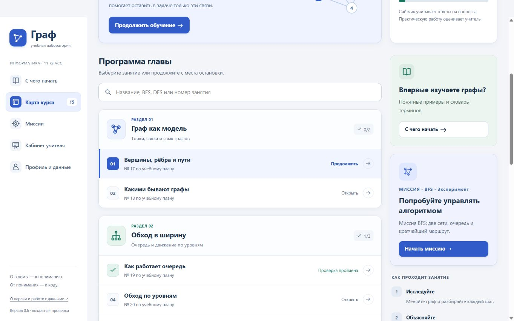

# Innovation · «Граф» — учебная лаборатория, версия 0.7

Рабочая версия для самостоятельного тестирования. Курс на русском и казахском по главе «Алгоритмы на графах» для 11 класса.

Это веб-приложение с работающими аккаунтами и базой данных. Его можно запустить локально либо разместить как закрытый пилот на Linux VPS. Для локального запуска не открывайте `index.html` двойным щелчком: запустите сервер по инструкции ниже.

Для просмотра начните со [сценария просмотра на 15–20 минут](REVIEW_GUIDE.md). Там есть конкретные действия, ожидаемые результаты и вопросы для обратной связи. Замечания можно оставить во вкладке **Issues → New issue → Отзыв по версии 0.7** либо передать автору сообщением.



GitHub хранит исходники. После скачивания репозитория приложение запускается на вашем компьютере; аккаунты и результаты в эту копию не включены. Общей опубликованной онлайн-версии пока нет.


**С версии 0.5:** экспериментальная миссия BFS «Передай сообщение». Ученик сам выполняет очередь на двух графах, строит маршруты, получает подсказки и объясняет результат. [Как провести эксперимент — GAMIFICATION.md](GAMIFICATION.md). [Аудит версии 0.4](PRODUCT_AUDIT.md), [история версий](VERSIONS.md), [қазақша нұсқаулық](README.KK.md), [что изучать автору](LEARNING_GUIDE.md).

## Если уже пользовались 0.1–0.6

Текущая рабочая папка обновлена до 0.7. База `.local/` не переносилась и не удалялась; схема базы совместима с версиями 0.1–0.6. Перезапустите сервер и обновите страницу. Для сравнения сохранены отдельные архивы предыдущих версий.

В репозиторий и архивы для передачи намеренно не включается база пользователей. При запуске исходников в новой папке создаётся новая база. Для переноса своей локальной тестовой базы сначала остановите оба сервера и сделайте резервную копию папки `.local/`, затем перенесите её целиком в новую папку проекта. Не копируйте работающую SQLite-базу отдельным файлом. Размещение через Docker по умолчанию начинает с новой базы в отдельном постоянном томе.

## Быстрый запуск на Windows

1. Если получили ZIP, полностью распакуйте его в отдельную папку.
2. Откройте `START.cmd`.
3. Оставьте окно работающим. Откройте в браузере **http://127.0.0.1:4318**.
4. Для остановки нажмите **Ctrl+C** в окне сервера.

Для локального приложения нужен **Node.js 22.13 или новее**; версия проверена с Node.js 24.19. Для резервного копирования и полного набора автоматических тестов нужен **Node.js 24+**. `START.cmd` также умеет использовать установленный на этом компьютере runtime Codex. Если Node.js не найден, установите актуальный Node.js с официального сайта [nodejs.org](https://nodejs.org/).

Никакие npm-пакеты устанавливать не нужно. Альтернатива из терминала в папке проекта:

```sh
node server.mjs
```

В локальном режиме сервер слушает только `127.0.0.1`: другие компьютеры к этому запуску не подключаются. Используйте именно этот адрес, а не `localhost`. Порт 4318 нужен приложению, 4319 — отдельной среде Python. Если порты заняты, закройте предыдущий экземпляр. Можно задать другой `PORT`; второй порт автоматически равен `PORT + 1`. Для показа через интернет используйте отдельную [инструкцию размещения](DEPLOYMENT.md).

## Первый эксперимент с миссией BFS

1. В меню выберите **«Миссии» → «Начать миссию»**. Вход также есть в карте курса и занятиях 19–21.
2. Нажмите первую вершину очереди. Затем по возрастанию номеров нажимайте её ещё не открытых соседей. Добавленные вершины сразу отмечаются открытыми.
3. Нажмите **«Все соседи проверены»**. Повторяйте до конца обхода. Сортируйте только новых соседей, не всю очередь.
4. Соберите кратчайший маршрут кликами по вершинам и проверьте его. Ошибочную цепочку можно исправить кнопкой «Убрать последнюю».
5. Выполните BFS в другой сети с новым стартом, затем ответьте на вопрос и при желании добавьте объяснение.
6. Скачайте отчёт попытки. Он содержит действия, ошибки, обращения к подсказкам и ваш текст. Обсудите его с руководительницей.

Граф и номера под ним доступны с клавиатуры. «Связи текстом» открывает список соседей. Подсказки не снимают баллы; отдельный счётчик показывает число ситуаций, в которых вы запросили помощь. Для повторного прохождения есть «Пройти заново» с подтверждением. Перед новой попыткой можно скачать текущую.

**Миссия пока хранится только в этом браузере**, отдельно для гостя и каждого аккаунта. Она не синхронизируется между устройствами и не попадает автоматически в кабинет учителя. Скачивание данных в профиле включает локальную попытку. Очистка гостевых данных или удаление своего аккаунта очищает и соответствующую миссию на текущем устройстве.

Это экспериментальная тренировка; результат одной попытки не считается освоением всей темы. В отчёте нет таймера, рейтинга или школьной отметки. Для защиты браузера журнал ограничен 1000 действиями на каждом графе; новые попытки доступны.

## Как пользоваться новой картой курса

В центре — программа из пяти разделов. Поиск находит занятие по названию, BFS/DFS или номеру из плана. 01–15 — порядок внутри курса; № 17–32 — номера присланного учебного плана. Над программой — следующее занятие и прогресс проверок. Справа — помощь и вход в миссию. Цвет и пиктограмма обозначают тему раздела, а не сложность или оценку.

Откройте занятие: вкладки ведут от объяснения и графа к тренировке и практике Python. Панель шагов находится перед графом, состояние алгоритма — справа. Под графом открыты главная идея и действие для самостоятельной проверки. Предыдущий и следующий урок доступны внизу.

Выбранные ответы сохраняются между вкладками и после перезагрузки на этом устройстве, отдельно для гостя и каждого аккаунта. Успешная проверка из двух вопросов ещё не означает освоение всего навыка: практическое решение оценивается отдельно.

Для клавиатуры: стрелки переключают вкладки, Shift+Tab выводит из редактора кода; Escape, затем Tab позволяет выйти вперёд.

Если после обновления видите старый экран, проверьте надпись «Версия 0.7» внизу навигации и остановите сервер из старой распакованной папки. Один и тот же адрес может обслуживать только один запущенный экземпляр.

## Как включить казахский язык

Справа в верхней панели выберите **Қазақша**. Выбор сохраняется после обновления страницы. Вернуться на русский можно там же; регистрация для этого не нужна.

Язык общий для интерфейса, объяснений, вопросов и практики. Текущий шаг, выбранные ответы и Python-черновик сохраняются при переключении; прогресс у обоих языков общий. Вращение камеры 3D сбрасывается, автопроигрывание приостанавливается, запущенная Python-проверка останавливается с уведомлением. Собственный код, имена и комментарии не переводятся. В режиме показа сначала выйдите из него, чтобы увидеть верхнюю панель.

Перевод требует языковой и предметной вычитки с руководительницей. Где менять формулировки и как устроены переводы — [LOCALIZATION.md](LOCALIZATION.md).

## Что уже работает

- Миссия BFS: ручная очередь, две сети, маршруты, объяснение и локальный отчёт.
- Карта из **15 занятий**, соответствующих позициям 17–30 и 32 присланного плана.
- Объяснения, учебные цели, **30 вопросов** с обратной связью.
- Исследование вершин и степеней, обычных, направленных, разветвлённых и несвязных графов.
- BFS с очередью; рекурсивный DFS со стеком вызовов и возвратами.
- Кратчайший путь через BFS. Дейкстра — дополнительный режим занятия 28.
- Назад/вперёд, ползунок истории, авто и предсказание следующего действия.
- Сравнение BFS и DFS по проверкам соседей и размеру очереди / стека.
- Редактор графа: 2–12 вершин, рёбра, направления и положительные целые веса.
- Выполнение настоящего Python через Pyodide; проверки BFS, DFS и поиска пути.
- Регистрация, вход и выход; роли ученика и учителя.
- Классы, присоединение по коду, назначение занятий, отправка кода и комментарии учителя.
- Сохранение прогресса и работ, выгрузка собственных данных, удаление аккаунта.
- Режим показа для проектора: убирает навигацию и освобождает место для графа.
- 3D: вращение, масштабирование, перемещение вершин, сброс камеры и раскладки.
- Экспорт/импорт применённого графа в JSON; словарь и маршрут для новичка.

Занятие 31 — ТЖБ за четверть — не представлено отдельным экзаменом, поскольку оно может охватывать другие разделы. Занятие 29 содержит тренировочную проверку, а не утверждённую БЖБ.

## Как попробовать 3D

1. Откройте занятие **17** или **19**, вкладку «Объяснение и граф».
2. Над схемой выберите **«3D · пространство»**.
3. Зажмите левую кнопку мыши и потяните граф. Колесо приближает и отдаляет; есть отдельные кнопки `+` и `−`.
4. В поле **«Мышь»** выберите **«Перемещение вершин»**. Перетяните кружок. После поворота сможете переместить его в другой плоскости пространства.
5. Короткий клик по вершине в исследовании показывает её связи; в алгоритме выбирает новый старт и сбрасывает шаги.
6. Нажмите «Шаг вперёд», затем переключитесь в 2D. Текущий шаг сохраняется.
7. **«Вернуть камеру»** сбрасывает ракурс и масштаб; **«Вернуть вершины»** также восстанавливает исходную пространственную раскладку.

Клавиатура: Tab до области 3D, стрелки для поворота, `+`/`−` для масштаба, Home для сброса камеры. На выделенной вершине Enter или пробел выбирают её. Сравнение двух алгоритмов в занятиях 29–30 остаётся в 2D.

Поворот и перемещение меняют только рисунок. Связи меняются в редакторе графа. Вес ребра не зависит от расстояния между точками. 3D может помочь рассмотреть пересечения, но при некоторых ракурсах подписи перекрываются: поверните камеру или вернитесь к 2D. Мы пока проверяем учебную пользу этого режима.

Технически это XYZ-модель с перспективной проекцией в SVG, без WebGL и без дополнительного CDN. Положение камеры сохраняется при шагах алгоритма, но сбрасывается при пересоздании вида, смене примера или занятия.

## Как передать свой граф руководителю

1. Нажмите «Редактор графа», задайте вершины и рёбра, нажмите «Применить граф».
2. Снова откройте редактор → **«Скачать применённый граф»**.
3. Передайте полученный `uchebny-graf.json`. На другом компьютере: «Редактор графа» → **«Открыть JSON-файл»**.

Файл содержит номера вершин, связи, веса и базовые 2D-координаты. Аккаунты и ответы учеников туда не входят. Несохранённые изменения текста редактора и текущий ракурс/перемещения в 3D не экспортируются. Импорт проверяет формат, число вершин и допустимость рёбер; повреждённый файл не применяется.

## Первая проверка без регистрации — 10 минут

1. Откройте занятие **19 «Как работает очередь»**.
2. Нажмите «Шаг вперёд» два раза. Проверьте объяснение и очередь `[4, 3, 5]`.
3. Вернитесь назад, включите «Сначала предсказать следующее действие».
4. Выберите пример «Несвязный» и доведите обход до конца.
5. Откройте занятие **23 «Рекурсия и возврат»**, следите за стеком вызовов.
6. Откройте занятие **30**, сравните BFS и DFS на одинаковом графе.
7. Попробуйте «Режим показа». Повторное нажатие или Escape возвращает обычный вид.

Прогресс гостя сохраняется в текущем браузере. Он не переносится автоматически в аккаунт: учебные попытки разных пользователей не смешиваются.

## Проверка Python — 5 минут

1. Откройте занятие **21 «Пишем BFS на Python»**, вкладку **«Практика Python»**.
2. Нажмите **«Показать пример» → «Загрузить в редактор»**.
3. Нажмите **«Запустить проверки»**. Первый запуск загружает интерпретатор из интернета.
4. Правильный пример должен пройти **8 из 8 проверок**.
5. Измените код — например, удалите добавление соседей в очередь — и запустите снова.
6. В занятии **24** рекурсивный DFS проходит 8 графовых проверок и дополнительную проверку наличия рекурсивного вызова: **9 из 9**.
7. В занятии **27** поиск пути проходит **8 из 8**, принимается любой кратчайший маршрут.

Система проверяет обычный граф, развилку, цикл, недостижимую цель, совпадение старта с целью, одну вершину, направленные связи и наличие нескольких кратчайших маршрутов. Для BFS/DFS зафиксирован возрастающий порядок соседей.

При бесконечном цикле выполнение останавливается через 8 секунд после загрузки Python. Есть и ручная кнопка остановки. Для загрузки файлов интерпретатора предусмотрено до 90 секунд. При недоступном CDN показывается ошибка, результат не подменяется имитацией.

Код выполняется в браузере. На CDN загружаются запросы за файлами интерпретатора, а не решения. При нажатии «Сохранить работу для учителя» код и пояснение сохраняются на локальном сервере.

## Полный сценарий «учитель → ученик → учитель»

Используйте **два разных браузера или два отдельных профиля**. Обычные вкладки одного профиля делят аккаунт. Например: учитель в Edge, ученик в Chrome; либо один в обычном, другой в приватном окне.

### Учитель

1. Нажмите **«Войти» → «Создать аккаунт»**.
2. Введите вымышленное имя, логин латиницей и пароль длиной от 10 символов.
3. Выберите роль **«Учитель»**.
4. В кабинете учителя создайте класс, например `11 А · тест`.
5. Скопируйте код приглашения.
6. Назначьте занятие **21**.

### Ученик

1. В другом профиле зарегистрируйте аккаунт с ролью **«Ученик»**.
2. Откройте **«Мои задания»**, введите код класса.
3. Откройте назначенное занятие, изучите визуализацию.
4. На вкладке **«Тренировка»** ответьте на вопросы и проверьте ответы.
5. На вкладке **Python** напишите код, запустите проверки, добавьте объяснение решения.
6. Нажмите **«Сохранить работу для учителя»**. Автосохранение черновика в браузере само по себе работу учителю не отправляет.

### Снова учитель

1. Откройте кабинет учителя и нажмите **«Обновить»**.
2. В строке ученика увидите результаты вопросов и сохранённую работу Python.
3. Откройте работу, изучите код, заметку и отчёт самопроверки.
4. Оставьте комментарий.
5. Ученик после обновления страницы увидит комментарий в заданиях и во вкладке Python соответствующего урока.

Самопроверка Python не является защищённой итоговой оценкой. Её результат приходит с компьютера ученика и может быть изменён технически подготовленным пользователем. Проверки вопросов рассчитывает сервер, но сами задания открыты и предназначены для тренировки. Высокозначимая аттестация в версии 0.3 не реализована.

## Как устроен редактор графа

Откройте «Редактор графа» на вкладке визуализации. Укажите число вершин и список рёбер:

```text
1 2 3
1 4 2
2 3 1
```

Первая строка означает ребро между 1 и 2 с весом 3. Если вес не указан, используется 1. Для направленного графа строка означает переход от первого номера ко второму.

Нажмите «Применить граф». Кнопка сохранения сохраняет **уже применённый граф** в браузере; чтобы сохранить новые правки, сначала примените их. Свой граф пока не прикрепляется к назначению класса: учитель назначает занятия из готового курса. Это отдельная задача следующей версии.

## Данные и резервная копия

- Локально аккаунты, классы, попытки и отправленные работы — в `.local/classroom.sqlite`; в Docker — в постоянном томе `/data`, имя выбирается через `DB_FILENAME`.
- Гостевой прогресс, черновики, попытки миссии и пользовательский граф — в `localStorage` браузера.
- Для простой локальной резервной копии остановите сервер и скопируйте папку `.local` целиком в защищённое место.
- Локальную копию восстанавливайте при остановленном сервере в новую папку проекта, сохранив прежнюю базу. Для Docker предусмотрено согласованное копирование работающей SQLite и восстановление в **новый файл** с переключением `DB_FILENAME`; шаги приведены в [DEPLOYMENT.md](DEPLOYMENT.md).
- Через «Профиль и данные» пользователь может скачать свои результаты или удалить аккаунт с подтверждением паролем.
- Удаление аккаунта учителя удаляет его классы, назначения и комментарии; аккаунты учеников остаются.

Копии Docker по умолчанию остаются на том же VPS: скачивайте их также в защищённое место вне сервера. В пилоте нет восстановления забытого пароля через почту. Запишите пароли тестовых аккаунтов или создайте другой тестовый аккаунт. Реальные данные школьников пока не используйте.

## Исходники и публикация в GitHub

В репозиторий добавляйте исходники из этой папки. `.gitignore` исключает `.local`, настоящие `.env`-файлы, `secrets/`, `backups/`, логи и `node_modules`; шаблоны настроек остаются в Git. **Не загружайте SQLite-базу, её резервные копии, выгрузки результатов и пароли**, даже в закрытый репозиторий.

В ZIP входят исходники и документация; база и тестовые пользовательские данные в него не включаются. Репозиторий и приглашение руководительницы эта версия автоматически не создаёт.

Папки:

```text
public/           интерфейс, модель графа, материалы курса, Python
tests/            проверки модели, API, настроек и резервных копий
scripts/          healthcheck, резервное копирование и восстановление
server.mjs        сервер, аккаунты, классы, SQLite; local/demo
server-config.mjs проверка конфигурации и чтение секрета
server-security.mjs ограничения запросов и граница доверия прокси
static-files.mjs  gzip, ETag и доставка публичных файлов
Dockerfile        образ Node.js 24 для хостинга и отдельный test target
compose.yaml      приложение, Caddy, резервные копии и постоянные тома
deploy/Caddyfile  HTTPS и маршрутизация двух имён
DEPLOYMENT.md     запуск на VPS, обслуживание, восстановление и откат
PRODUCT_AUDIT.md  аудит версии 0.4 и дальнейшие приоритеты
GAMIFICATION.md   сценарий и критерии эксперимента с миссией
START.cmd         запуск на Windows
ARCHITECTURE.md   устройство и ограничения
TESTING.md        сценарии самостоятельной проверки
```

Для запуска полного набора тестов используйте **Node.js 24+**:

```sh
node --test
```

Тесты создают отдельные временные базы и тестовые серверы. Основную базу не меняют. На Node.js 22 часть проверок утилит хостинга пропускается; это не полный прогон версии 0.7. npm и дополнительные пакеты не требуются. В [GitHub Actions `Hosting checks`](https://github.com/9dmssi1/Innovation/actions/runs/37822934410) прошли 69 тестов без ошибок и пропусков на Linux в Docker с Node.js 24.21; также проверены контейнеры, доступ и сохранение аккаунта после пересоздания приложения. Это не проверка реального HTTPS-размещения. Подробности — [TECH_REVIEW_V07.md](TECH_REVIEW_V07.md).

---

# Innovation · «Граф» оқу зертханасы

**0.7 нұсқасы · 11-сынып · Қазақ және орыс тілдері**

Innovation — 11-сынып оқушыларына графтар теориясын және графтағы алгоритмдерді түсінуге көмектесетін интерактивті оқу платформасы.

Оқушы алгоритмнің әр қадамын көріп, оның түсіндірмесін оқиды, келесі әрекетті болжайды және Python тілінде практикалық тапсырмалар орындайды. Мұғалім платформаны сабақта көрсетуге, тапсырма беруге және оқушының жұмысына пікір қалдыруға пайдалана алады.

Қазіргі нұсқа өз бетімен сынауға және дипломдық жұмыстың ғылыми жетекшісімен талқылауға арналған. Оқу материалдары ұсынылған тақырыптық жоспар негізінде әзірленген. Оларды мектепте қолданар алдында мазмұнын, терминологиясын және оқу мақсаттарына сәйкестігін мұғаліммен бірге тексеру қажет.

## Платформада не бар?

Курс бес бөлімнен және 15 сабақтан тұрады:

1. **Графтар теориясының негіздері** — төбе, қабырға, доға, жол, төбенің дәрежесі және граф түрлері.
2. **Көлденеңінен іздеу — BFS** — кезектің жұмысы және графты қадам бойынша айналып өту.
3. **Тереңнен іздеу — DFS** — рекурсия, шақырулар стегі және алдыңғы төбеге қайту.
4. **Ең қысқа жолды іздеу** — BFS арқылы жол табу және қосымша Дейкстра алгоритмі.
5. **Алгоритмдерді салыстыру** — BFS пен DFS жұмысын бақылау және тапсырмаға сәйкес әдісті таңдау.

Қолжетімді мүмкіндіктер:

- алгоритмді алға және артқа қадамдап орындау;
- ағымдағы төбені, кезекті, стекті және қашықтықтарды бақылау;
- келесі әрекетті алдын ала болжау;
- графты 2D және 3D режимдерінде зерттеу;
- өз графын құру, сақтау және JSON файлы арқылы бөлісу;
- түсінуді тексеруге арналған 30 сұрақ;
- Python кодын браузерде орындау және тексеру;
- оқушы мен мұғалім аккаунттары;
- сынып құру, код арқылы қосылу және сабақ тағайындау;
- оқушының жұмысын сақтау және мұғалімнің пікірін алу;
- проекторға арналған көрсету режимі;
- «Хабарламаны жеткіз» атты тәжірибелік BFS миссиясы.

Курс ішіндегі 01–15 нөмірлері сабақтардың ретін көрсетеді. № 17–30 және 32 нөмірлері ұсынылған оқу жоспарына сәйкес келеді. Тоқсандық жиынтық бағалау жеке емтихан ретінде әзірленбеген.

## 0.7: тұрақты серверге орналастыру

Linux VPS үшін Docker Compose конфигурациясы дайындалды: қолданба, HTTPS үшін Caddy және SQLite дерекқорының резервтік көшірмесін жасайтын қызмет. Node.js 24 контейнерге енгізілген. Платформа мен браузердегі Python ортасына екі бөлек домен атауы қажет.

Онлайн-нұсқада алдымен жабық демонстрацияның ортақ логині мен құпиясөзі сұралады. Одан кейін оқушы мен мұғалім платформаның жеке аккаунтына кіреді. Ортақ құпиясөз GitHub-та сақталмайтын бөлек файлдан оқылады. Репозиторийдің ашық болуы жабық демонстрацияға автоматты түрде қолжетімділік бермейді.

Дерекқор тұрақты Docker томында сақталады. Қызмет іске қосылғанда және одан кейін әр 24 сағат сайын көшірме жасалады; әдепкіде соңғы 14 көшірме сақталады. Бұл міндетті түрде 14 күндік тарих емес: қолмен іске қосу мен қайта іске қосу қосымша көшірме жасайды. Көшірмелерді серверден тыс қауіпсіз жерге де сақтау керек.

Қалпына келтіру құралы бұрынғы базаны алмастырмай, тек жаңа файл жасайды. Тексерілгеннен кейін `DB_FILENAME` арқылы қолданба мен көшірме қызметі сол файлға ауыстырылады. Іске қосу, жаңарту және қалпына келтіру: [DEPLOYMENT.md](DEPLOYMENT.md). Баптаулар үлгісі: [.env.hosting.example](.env.hosting.example). Тексерулер мен шектеулер: [TECH_REVIEW_V07.md](TECH_REVIEW_V07.md).

Docker конфигурациясы [GitHub Actions тексеруінен сәтті өтті](https://github.com/9dmssi1/Innovation/actions/runs/37822934410): Linux контейнерінде Node.js 24.21 арқылы 69 тест қатесіз және өткізіп жіберусіз орындалды. Қолданба мен көшірме қызметінің жұмысы, кіру шектеуі және контейнер ауыстырылғаннан кейін аккаунттың сақталуы тексерілді. Caddy конфигурациясының жарамдылығы тексерілгенімен, бұл нақты TLS сертификаты алынғанын білдірмейді. **Сайт әлі жарияланған жоқ:** нақты VPS, DNS және HTTPS арқылы браузердегі жұмысын бөлек тексеру қажет. Жергілікті `START.cmd` арқылы іске қосу өзгермейді.

## 0.6 нұсқасында не өзгерді?

- Сабақ карточкалары, белгішелер және басқару элементтері ірілендірілді.
- Оқуды жалғастыру және оқу барысын көру жеңілдетілді.
- Графты басқару батырмалары бір панельге біріктірілді.
- Деректерді сақтау, экрандар арасында ауысу және редактор жұмысына қатысты қателер түзетілді.

Техникалық тексерулер мен белгілі шектеулер:
[TECH_REVIEW_V06.md](TECH_REVIEW_V06.md).

## Компьютерде іске қосу

**Жергілікті қолданбаға Node.js 22.13 немесе одан жаңа нұсқа қажет. Резервтік көшіру құралдары мен автоматты тесттердің толық жиынтығына Node.js 24+ керек.**

Node.js орнатылғанын терминалда тексеруге болады:

```sh
node --version
```

### Windows

1. Репозиторийден **Code → Download ZIP** арқылы жобаны жүктеп алыңыз.
2. Мұрағатты толық ашыңыз.
3. Жоба қалтасындағы `START.cmd` файлын іске қосыңыз.
4. Сервер терезесін ашық қалдырыңыз.
5. Браузерде мына мекенжайды ашыңыз:

   http://127.0.0.1:4318

Серверді тоқтату үшін оның терезесінде **Ctrl+C** басыңыз.

### Терминал арқылы

Windows, macOS немесе Linux жүйесінде жоба қалтасынан орындаңыз:

```sh
node server.mjs
```

Қосымша npm-пакеттерін орнату қажет емес.

**Маңызды:** `index.html` файлын екі рет басып ашу жеткіліксіз — өз компьютеріңізде пайдалану үшін жергілікті серверді іске қосыңыз. Автор платформаны орналастырып, HTTPS-сілтеме бергеннен кейін оны браузерде ашуға болады; онда өз компьютеріңізге Node.js орнатудың қажеті жоқ.

GitHub-та жобаның бастапқы коды сақталады. Ортақ онлайн-нұсқа әзірге жарияланбаған. `127.0.0.1` мекенжайы платформаны іске қосқан компьютердің өзін білдіреді; басқа компьютер оған осы мекенжай арқылы қосыла алмайды.

4318 порты платформаға, 4319 порты Python ортасына қолданылады. Порт бос болмаса, бұрын іске қосылған серверді тоқтатыңыз.

## Алғашқы танысу

1. Жоғарғы панельден **«Қазақша»** тілін таңдаңыз.
2. **«Неден бастау керек»** бөлімін және сөздікті қараңыз.
3. 17–18-сабақтарда төбелерді, қабырғаларды және граф түрлерін зерттеңіз.
4. 19-сабақты ашып, **«Келесі қадам»** батырмасын басыңыз. Кезек пен түсіндірменің қалай өзгеретінін бақылаңыз.
5. Бір қадам артқа қайтып, келесі әрекетті өзіңіз болжаңыз.
6. 23-сабақта DFS пен шақырулар стегін қараңыз.
7. 30-сабақта BFS пен DFS алгоритмдерін бір графта салыстырыңыз.

Негізгі материалдармен тіркелмей танысуға болады. Қонақтың оқу барысы осы браузерде сақталады және аккаунтқа автоматты түрде көшірілмейді.

Тілді ауыстырғанда ағымдағы алгоритм қадамы, таңдалған жауаптар және жазылған код сақталады. Орындалып жатқан Python тексеруі тоқтатылады, ал 3D камерасы бастапқы көрініске оралады.

## Python тапсырмасын тексеру

1. 21-сабақтағы Python практикасын ашыңыз.
2. Дайын мысалды көрсетіп, редакторға жүктеңіз.
3. Кодты тексеруді іске қосыңыз.
4. BFS мысалы **8 тексерудің 8-інен** өтуі тиіс.
5. Кодтың бір бөлігін өзгертіп, қайта тексеріңіз. Қай жағдайларда қате пайда болғанын талдаңыз.

Бірінші іске қосу кезінде Python интерпретаторы интернеттен жүктеледі. Код браузерде орындалады.

Мұғалім жұмысты көруі үшін оны арнайы сақтау батырмасы арқылы жіберу керек. Кодтың браузерде автоматты сақталуы жұмыстың мұғалімге жіберілгенін білдірмейді.

Автоматты тексеру — жаттығуға көмектесетін құрал. Ол қорғалған қорытынды емтихан немесе мұғалім бағасының орнына қолданылмайды.

## Мұғалім мен оқушы жұмысын сынау

Екі бөлек браузерді немесе екі бөлек браузер профилін пайдаланыңыз. Бір профильдің кәдімгі қойындылары бір аккаунтты бөліседі.

### Мұғалім

1. Мұғалім рөлімен тест аккаунтын жасаңыз.
2. Сынып құрыңыз.
3. Сыныпқа қосылу кодын көшіріңіз.
4. Оқушыға сабақ тағайындаңыз.

### Оқушы

1. Басқа браузерде оқушы аккаунтын жасаңыз.
2. Мұғалім берген код арқылы сыныпқа қосылыңыз.
3. Тағайындалған сабақты ашыңыз.
4. Сұрақтарға жауап беріп, Python тапсырмасын орындаңыз.
5. Шешімге түсіндірме қосып, жұмысты мұғалімге сақтаңыз.

### Кері байланыс

Мұғалім өз кабинетін жаңартып, оқушының жұмысын ашады және пікір қалдырады. Оқушы бетті жаңартқаннан кейін пікірді көре алады.

Тестілеу кезінде ойдан шығарылған есімдерді қолданыңыз. Құпиясөз кемінде 10 таңбадан тұруы керек.

## «Хабарламаны жеткіз» BFS миссиясы

Бұл миссияда оқушы алгоритмнің әрекеттерін өзі орындайды:

1. Кезектегі бірінші төбені таңдайды.
2. Оның әлі ашылмаған көршілерін нөмірлерінің өсу ретімен кезекке қосады.
3. Барлық көршілер тексерілгенін растайды.
4. Графты айналып өткеннен кейін ең қысқа жолды құрастырады.
5. Екінші графта тапсырманы қайталап, нәтижесін түсіндіреді.

Тек жаңадан қосылатын көршілерді реттеу керек. Бүкіл кезекті қайта сұрыптауға болмайды.

Қате әрекеттен кейін түсіндірме беріледі. Қажет болса, көмек алуға және әрекетті қайталауға болады. Соңында әрекеттер, қателер мен түсіндірме қамтылған есепті жүктеп алуға болады.

**Миссия нәтижесі әзірге тек осы браузерде сақталады.** Ол басқа құрылғыға көшірілмейді және мұғалім кабинетіне автоматты түрде жіберілмейді. Миссия үшін мектеп бағасы қойылмайды.

## 3D режимі қалай жұмыс істейді?

Графтың үстінен 3D режимін таңдаңыз:

- тінтуірмен сүйреп, графты бұрыңыз;
- дөңгелекпен немесе `+` және `−` батырмаларымен масштабты өзгертіңіз;
- төбелерді жылжыту режимінде олардың орналасуын өзгертіңіз;
- қажет кезде камераны бастапқы күйге қайтарыңыз немесе 2D режиміне ауысыңыз.

**Төбелерді жылжыту графтың байланыстарын өзгертпейді.** Байланыстар граф редакторында өзгертіледі.

Қабырғаның салмағы экрандағы сызықтың ұзындығына тәуелді емес. Сондықтан суретте жақын тұрған төбеге апаратын жол міндетті түрде ең арзан немесе ең қысқа жол болмайды.

3D — қосымша зерттеу режимі. Оның оқу үшін қаншалықты пайдалы екенін тәжірибе барысында бағалау қажет.

## Деректер қайда сақталады?

- Жергілікті аккаунттар, сыныптар және жіберілген жұмыстар — `.local/classroom.sqlite` дерекқорында. Docker арқылы орналастырғанда деректер `/data` тұрақты томында, `DB_FILENAME` көрсеткен файлда сақталады.
- Қонақтың оқу барысы, кодтың жергілікті нұсқалары, миссия және пайдаланушы графы — браузердің жергілікті жадында.
- Жүктеп алынған репозиторийде автордың аккаунттары мен оқушы нәтижелері жоқ.

Жергілікті резервтік көшірме жасау үшін серверді тоқтатып, `.local` қалтасын толық көшіріңіз. Жұмыс істеп тұрған SQLite дерекқорын жеке файл ретінде көшірмеңіз. VPS үшін дайын көшіру және жаңа файлға қалпына келтіру құралдарын [DEPLOYMENT.md](DEPLOYMENT.md) бойынша қолданыңыз; бұрынғы базаны сақтап қойыңыз.

Дерекқорды, құпиясөздерді және жеке нәтижелерді GitHub-қа жүктемеңіз.

Электрондық пошта арқылы ұмытылған құпиясөзді қалпына келтіру әзірге іске асырылмаған. Осы нұсқаны сынау үшін нақты оқушылардың жеке деректерін пайдаланбаңыз.

## Жобаның техникалық құрылымы

Платформа HTML, CSS және JavaScript арқылы жасалған. Сервер Node.js пен SQLite қолданады. Python браузерде Pyodide арқылы орындалады.

Алгоритмдердің логикасы графты бейнелеу кодынан бөлінген: алгоритм қадамдар тізбегін дайындайды, интерфейс сол қадамдарды көрсетеді.

```text
public/           интерфейс, граф моделі және оқу материалдары
tests/            алгоритмдер мен серверді тексеру
scripts/          healthcheck, резервтік көшіру және қалпына келтіру
server.mjs        сервер, аккаунттар, сыныптар және дерекқор
compose.yaml      қолданба, HTTPS, көшірмелер және тұрақты томдар
DEPLOYMENT.md     VPS-ке орналастыру және қызмет көрсету
START.cmd         Windows жүйесінде іске қосу
ARCHITECTURE.md   архитектура және техникалық шектеулер
TESTING.md        өз бетімен тексеру сценарийлері
REVIEW_GUIDE.md   ғылыми жетекшімен бірге қарау сценарийі
```

Тесттердің толық жиынтығын Node.js 24 немесе одан жаңа нұсқада іске қосу:

```sh
node --test
```


Алғашқы танысу үшін [15–20 минуттық қарау сценарийін](REVIEW_GUIDE.md) пайдаланыңыз. Компьютерді дайындау уақыты бұл мерзімге кірмейді.

Талқылауға ұсынылатын сұрақтар:

- Оқушыға қай жерден бастау керектігі түсінікті ме?
- Визуализация алгоритмнің жұмысын түсіндіруге көмектесе ме?
- Түсіндірмелер мен қазақша терминдер дұрыс па?
- Тапсырмалар оқу мақсаттарына сәйкес келе ме?
- Мұғалімге жұмыс беру және кері байланыс қалдыру ыңғайлы ма?
- Қай үш жақсартуды бірінші орындау қажет?

Пікірді GitHub-та **Issues → New issue → «Отзыв по версии 0.7»** арқылы қалдыруға болады. Жергілікті қолданбаны немесе HTTPS-нұсқаны тексергеніңізді көрсетіңіз.

Мәселені сипаттағанда сабақ нөмірін, интерфейс тілін, орындалған әрекеттерді, күтілген және нақты нәтижені көрсетіңіз.
